# Need to discuss with niravbhai

1.tour guide
2.AI capabilities
3.Video/GIF as a Widget
4.'Set as default' functionality from templates
5.2 stepper changes for 1.support portal details 2.support portal customization

# tasks (implemented from PMG and then removed)
1.remove 'card templates' from parent section of 'Quick Action'. keep 'card templates' in individual action cards.
2.remove Custom 'Action card' widget from the sidedrawer of widget. 
3.action card's section should give feasibility to add external link button in that section from the parent section(Quick action)'s sidebar.
4.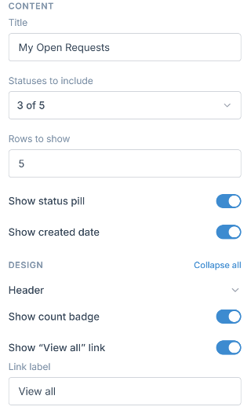 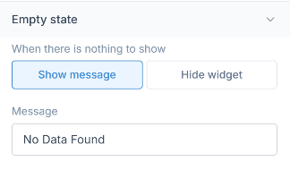 - see this attached images and remove this data from 'My open requests' predefined Section.
5.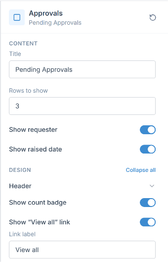  - see this attached images and remove this section fields from 'pending approval' widget.
6.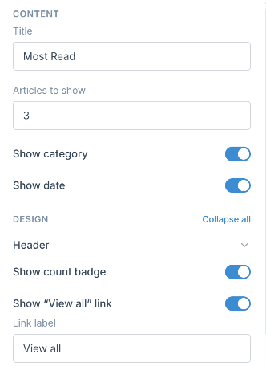  ,AD Self Service- see this attached images and remove this section fields from 'Most read' widget.
7.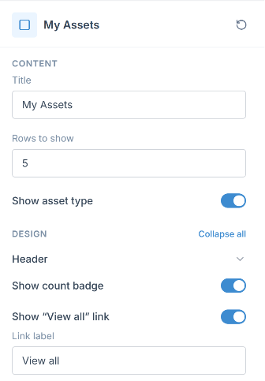  - see this attached images and remove this section fields from 'My Assets' widget.
8.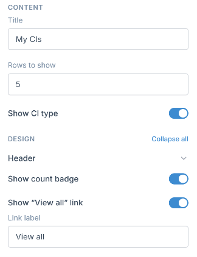  - see this attached images and remove this section fields from 'My CIs' widget.
9.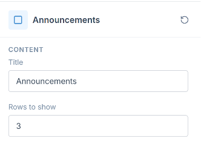  - see this attached images and remove this section fields from 'Announcements' widget.
10.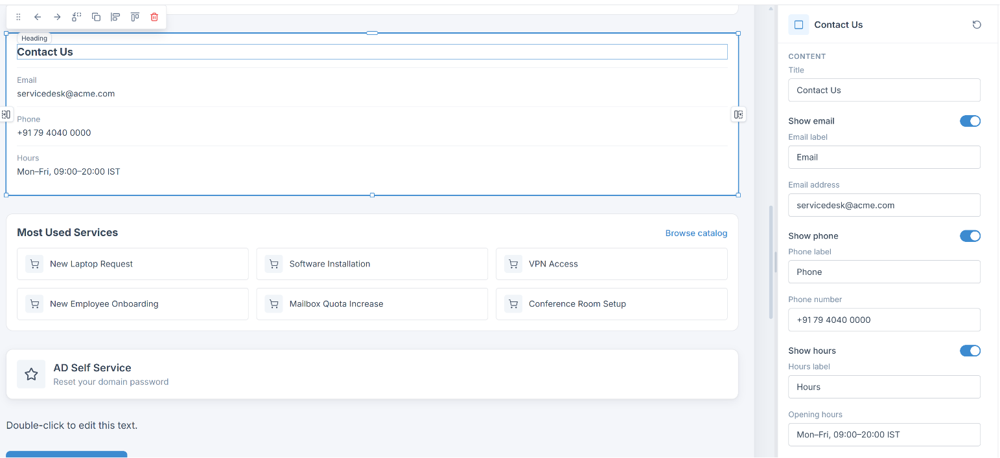  -  see this attached images and remove title,'Show hours' section and toggle for email and phone number fields. also remove email label and phone label fields we can's edit them, and give only email value and phone value as a editable input fields.
11.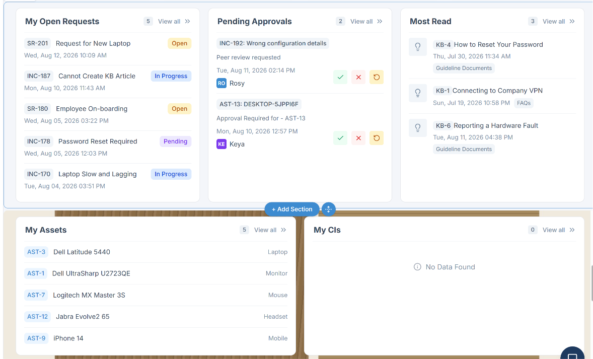 - see this image and you can see the count badge for this all 5 livedata widgets are given to the right side besides the view link field. so need to give the badges besides the Title of card as you can see in this image : 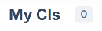 
12.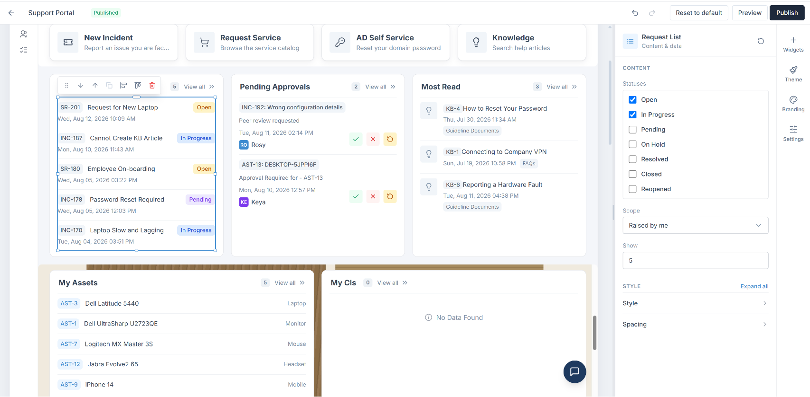 - no need to give option to select the open requests list from the 'My open requests' card. so remove that selection and sidebar configuration for this listing section.
13.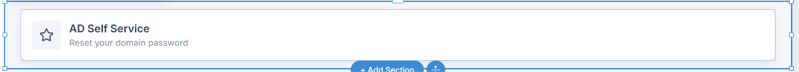 - remove this action card as a individual placement on page, it should only placed inside parent section of actions card. which is already placed. so need to remove clone functionality from floating toolbar of action cards and also need to disable the way to add action cards from widget sidebar as we were showing brfore.
14.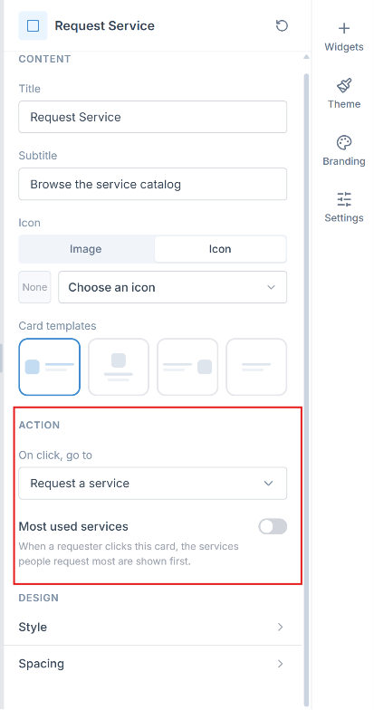 - remove 'action' section from the sidebar of each 4(New Incident,Request Service,AD Self Service,Knowledge) action cards.
15.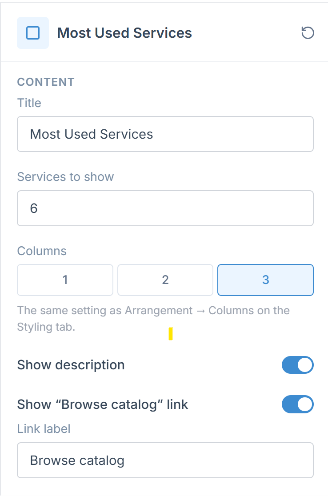  - see this attached images and remove this section fields except 'show description' toggle from 'Most Used Services' widget.
16.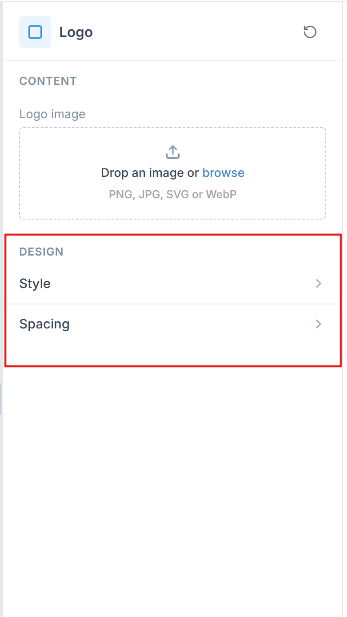 - remove design section from 'logo' sidebar.
17.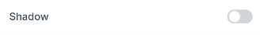 - see the image and remove 'shadow' field from navbar's sidebar.
18.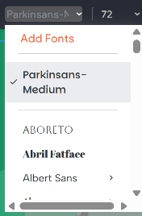 - see the image as a reference and nee to give inline font style editor for each floating toolbar of Test fields.
19.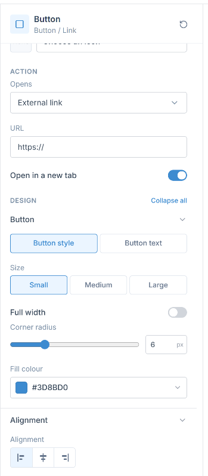 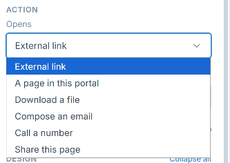 - see the image and remove 'Open in a new tab' this field from the button action. and see 2nd image and remove this 2 fields - 'a page in this portal' and 'click to call' from Deopdown.
20.as we are removing the all content edition from right sidebar of each predefined widget's as - all 4 action cards(New Incident,Request Service,AD Self Service,Knowledge), My Open req. pending approval, My assets, My CIs, favrouite Services, Frequenty used services, Announcements,Most read (knowledge) widgets will not more inline editable for heading. only action cards will have acess to edit inline for it's description field placed inside card. for other all mentioned Predefined widgets are not more inline editable.
21.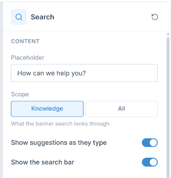 - see the image and remove all fields except search placeholder.
22.Now need to add 2 sections by showing max 4 cards inside it. 1.Favrouite Services , 2. Most used services. for reference i can give you old existing product's card UI design , you need to refine it ane make looks like our currnet component like(action cards UI). this is our current portal's UI : 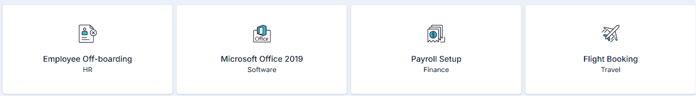 , this image is fav. services and most used services list for now to add in page. as a dummy data.
23.