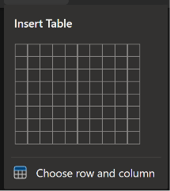
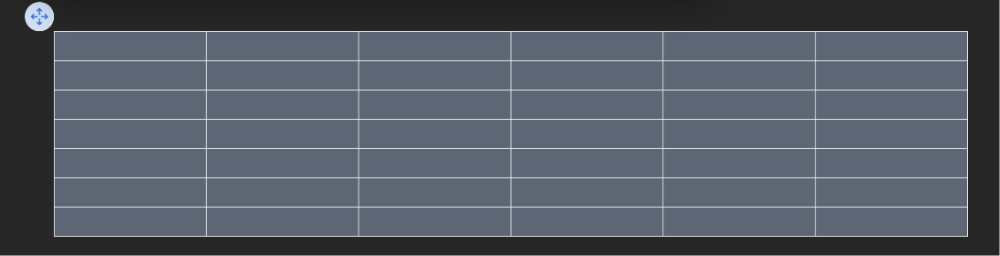
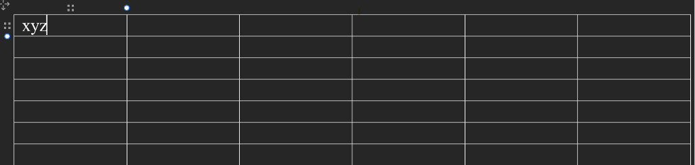
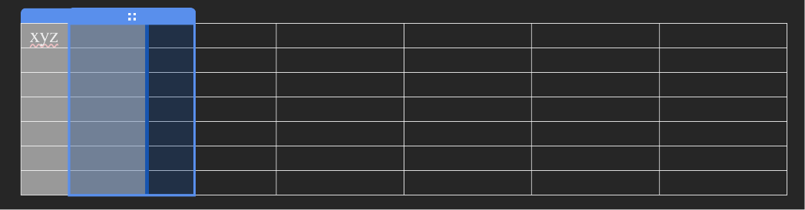
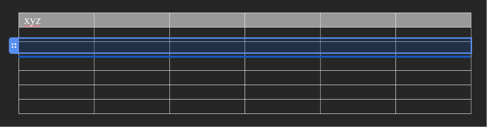
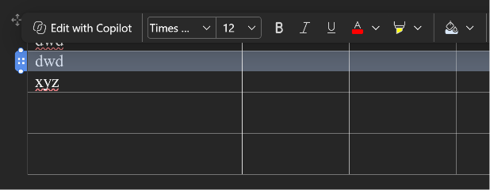
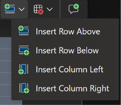
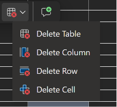
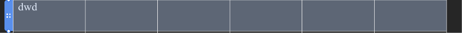

# Need to discuss with niravbhai

1.tour guide
2.AI capabilities
3.Video/GIF as a Widget
4.'Set as default' functionality from templates
5.2 stepper changes for 1.support portal details 2.support portal customization

# Need to discuss with Sahilbhai
1.KB for FAQs

# tasks (implemented from PMG and then removed)
1.remove 'card templates' from parent section of 'Quick Action'. keep 'card templates' in individual action cards.
2.remove Custom 'Action card' widget from the sidedrawer of widget. 
3.action card's section should give feasibility to add external link button in that section from the parent section(Quick action)'s sidebar.
4.  - see this attached images and remove this data from 'My open requests' predefined Section.
5.  - see this attached images and remove this section fields from 'pending approval' widget.
6.  ,AD Self Service- see this attached images and remove this section fields from 'Most read' widget.
7.  - see this attached images and remove this section fields from 'My Assets' widget.
8.  - see this attached images and remove this section fields from 'My CIs' widget.
9.  - see this attached images and remove this section fields from 'Announcements' widget.
10.  -  see this attached images and remove title,'Show hours' section and toggle for email and phone number fields. also remove email label and phone label fields we can's edit them, and give only email value and phone value as a editable input fields.
11. - see this image and you can see the count badge for this all 5 livedata widgets are given to the right side besides the view link field. so need to give the badges besides the Title of card as you can see in this image :  
12. - no need to give option to select the open requests list from the 'My open requests' card. so remove that selection and sidebar configuration for this listing section.
13. - remove this action card as a individual placement on page, it should only placed inside parent section of actions card. which is already placed. so need to remove clone functionality from floating toolbar of action cards and also need to disable the way to add action cards from widget sidebar as we were showing brfore.
14. - remove 'action' section from the sidebar of each 4(New Incident,Request Service,AD Self Service,Knowledge) action cards.
15.  - see this attached images and remove this section fields except 'show description' toggle from 'Most Used Services' widget.
16. - remove design section from 'logo' sidebar.
17. - see the image and remove 'shadow' field from navbar's sidebar.
18. - see the image as a reference and nee to give inline font style editor for each floating toolbar of Test fields.
19.  - see the image and remove 'Open in a new tab' this field from the button action. and see 2nd image and remove this 2 fields - 'a page in this portal' and 'click to call' from Deopdown.
20.as we are removing the all content edition from right sidebar of each predefined widget's as - all 4 action cards(New Incident,Request Service,AD Self Service,Knowledge), My Open req. pending approval, My assets, My CIs, favrouite Services, Frequenty used services, Announcements,Most read (knowledge) widgets will not more inline editable for heading. only action cards will have acess to edit inline for it's description field placed inside card. for other all mentioned Predefined widgets are not more inline editable.
21. - see the image and remove all fields except search placeholder.
22.Now need to add 2 sections by showing max 4 cards inside it. 1.Favrouite Services , 2. Most used services. for reference i can give you old existing product's card UI design , you need to refine it ane make looks like our currnet component like(action cards UI). this is our current portal's UI :  , this image is fav. services and most used services list for now to add in page. as a dummy data.
23.In this prompt i am giving a new task to you which we haven't even think of it in this project's conversation so ask me anything if you have doubt about and don't make assumptions : Now let me give you context brfore design it. we are adding new section and giving split section icon to the right and left of the section. but what we want to achieve for all these Basic, Visual and Custom section's all widgets is -> i will drag and add any widget in an any new added empty section as row wise, as in the element should placed row wise even it can be a text,image,accordian,button,table,divider(it's hide component which need to brings back but ask me first once you reach this task), List(not added now but need to write this Listing widget in future task md file), media slider,advanced tab,spacer, and text with image will be written in future task md file(no need to implement them now). and we will make sure that user drag and drop or select element from widget section and add from add icon placed in middle, the element will by default placed on left so every elements can be placed accordingly.

-now hope you understands the usecase of adding elements row wise, no i can able to change the gap between the elements by giving gap field to sidebar for custom made section. also i can add divider between the elements in custom section. now i am adding 2 elements row wise for example let me give you context by giving example of how this functionality would works : i am placing image in 1st row with any default size of image. then i am adding a title in 2nd row and description in 3rd row. then now i wants image as a top-left column  and text and description with merging the rows and place it to the right column of image which will be invisible for user but we will give/provide a way to feel user on UI perspective that he can place or put that merged row in a column. now i want you to think that how should we solve this problem in a way that admin user can easily customize the section like this behaviour by just dragging elements row wise and splitting the row column wise but... inside the 1 section.
-> let me give another usecase for example i wants to add title and description then a table from widget , then i will simply add title which shows on topleft by default then same description will placed in new row and table will placed in new row. in this case there is no need of any requirement of more styling except gab bwetween 2 items. 

-i am thinking that for this complex thinking we can just simply split - the row into columns from the rows and which will have the same height any widget is placed. and if user deletes any column inside the section then anoither section rearrange it's position to left side with it's default height.

24.now let's come to the table widget - in table widget remove the whole configuration of table as per now and give it to edit table's data as Word is giving you can see that in attached image. 1st Word gives the column selection from the 10x10 rows and column, and after adding the data in column from the inline cell selection as you can see in image with inline text floating toolbar.        

-> so see all attached image and you will get idea how out table should looks like and how i can manage each row and colunmn, i can drag them smoothly, i can edit them from given floating toolbar action same as work is giving as attached image.insert and delete any row,column,table or cell.we will give cell wise inline edit for text instead of popup and all things. and max 10 by 10 rows column can be come. so there is no need of other styling inside the table. keep titel field from content section and spacing in style section. other given instructions like table row column selecting will show on popup on click of insert table field and  i should increase the cell padding by just stratcinh from the bottom. so only keep spacing section for table remove all other things, cause we are handling it from inline. 

25.Action cards cannot be placed on their own, you removed action cards from the widgets which is not correct, bring back them but we need to show disabled state with added icon to right of the card for each predefined cards in live data and in action cards also. nothing will be removed from the widget sidebar.

26.Contact Us section still have the inline editable fields and not removed hours fields from the contact us card. please fix it.and empty section is also not removed from sidebar.

27.
